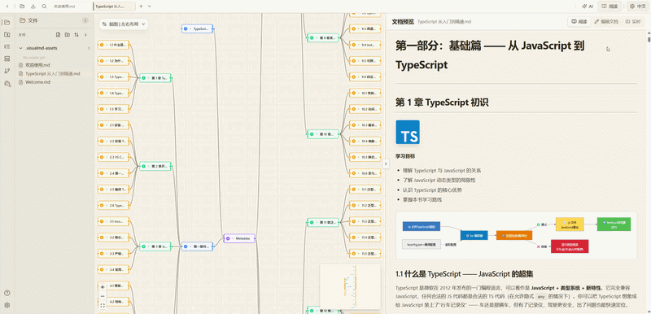
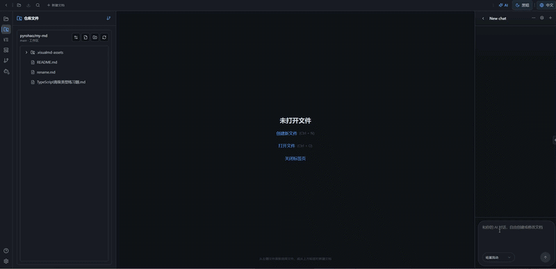
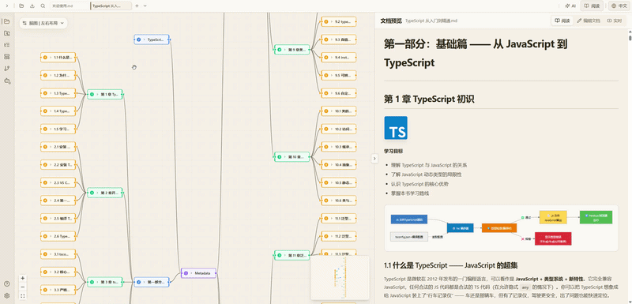
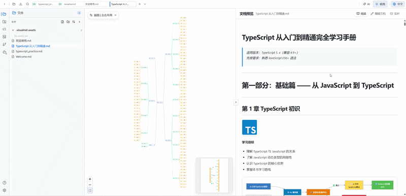

# VisualMD · Markdown Knowledge Creation Workbench

<p align="center">
  
</p>

<p align="center">
  <strong>Think visually. Write in Markdown. Version everything.</strong>
</p>
<p align="center">
  Visual structure building · Native Markdown creation · AI assistance · Git management, browser completes the entire knowledge production process
</p>

<p align="center">
  <a href="#Quick Start">Quick Start</a> ·
  <a href="#Why Choose -visualmd">Why Choose VisualMD</a> ·
  <a href="#ai--git">AI & Git</a> ·
  <a href="#Advanced Configuration">Advanced Configuration</a> ·
  <a href="#Local Development and Run">Local Development and Run</a>
</p>

<p align="center"> 
   
   
   
   
   
  
</p>

<p align="center">
  <strong>中文</strong> | <a href="./README.en.md">English</a>
</p>

---

## Quick Start 
No installation or registration required, just access and use: [VisualMD](https://genfor.me/)

For secondary development, private deployment, and custom functions, jump to the end of the article [Local Development and Running](#Local Development and Running).


<p align="center">
  
</p>

> Three theme modes, adapted for editing, previewing, and reading scenarios, reducing visual fatigue during long editing sessions.

## More Than Just a Markdown Editor

### 1. AI + Git Embedded

<p align="center">
  
</p> 
VisualMD integrates multiple tool capabilities into a single browser workspace, providing a unified platform:

- Visual tree-structured document interface
- Standard native Markdown editing
- Context-sensitive AI document collaboration
- Lightweight Git version control
- Unified asset management for images, Mermaid, and formulas

Say goodbye to switching between multiple software programs:

``` 
VisualMD = Markdown editor + mind map + AI dialogue window + Git management
```

### 2. Real-time Editing

<p align="center">
  
</p>

- Expands Markdown headings into a visual structure tree, ideal for building the framework first and then adding content chapter by chapter.
- Supports batch creation of child nodes, drag-and-drop reorganization, and node disconnection and reconnection, significantly reducing the cost of adjusting long document structures.
- The same document can be switched between text, preview, live, prototype, and split views.
- Supports the `@proto` directive to directly derive an interactive prototype from the document, reducing the need for redundant maintenance of "one document, one draft".
- Markdown preview supports images, Mermaid, and mathematical formulas, and performs HTML whitelist cleaning by default.


### 3. Document Outline Sidebar

<p align="center">
  
</p>

- Real-time extraction of the current Markdown heading levels, making the structure of long documents immediately apparent.
- Clicking the outline jumps to the corresponding content location, eliminating reliance on pure source code scrolling for navigation.
- Adjusting canvas node numbers quickly organizes sibling heading content.
- Especially valuable for long content such as technical documents, design documents, knowledge bases, and prompt documents.

---

## Why Choose VisualMD

### Organize the Structure 
First, Then Fill in the Content When writing long documents or knowledge bases, the biggest waste isn't typing, but repeatedly adjusting the chapter structure.

VisualMD automatically converts Markdown headings into a visual, operable document tree, supporting:
- Batch creation of chapter nodes
- Global overview for planning the entire document's logic
- Refining the main text paragraph by paragraph after the framework is finalized

Suitable for: Technical documents, product solutions, system learning notes, academic research reports, and long-form articles.

### AI Deeply Embedded in Documents, Not a Separate Chat Window

Traditional AI usage workflow is fragmented and cumbersome:

``` 
Open AI webpage → Copy and paste document fragment → Wait for generation → Copy content and switch back to the editor
```
VisualMD Natively Embedded AI Editing Flow:

``` 
Current document → Select paragraph → AI reads → Assisted editing
```
AI Copilot Support Capabilities:

- Content expansion, simplification, and polishing
- Full text/paragraph rewriting, style adjustment
- Article logical structure optimization
- Content bug review and proofreading
- One-click generation of new chapters

All AI modifications are fully controllable:

- Supports one-click undoing of all automatic changes
- Preview and confirm modified content before silently overwriting the original text

### Git! Maintain Knowledge Assets Like Code
Project READMEs, technical manuals, product PRDs, design specifications, and knowledge bases are all stored in Markdown, naturally compatible with the Git version control system.

VisualMD features a complete built-in Git workflow, requiring no additional client:

- Online browsing of remote repository directory trees
- Direct editing of Markdown files within the repository
- Automatic generation of standard resource paths when pasting images
- Unified staging and batch commit of text and image assets
- Three-column visual conflict detection and merging processing

Documents are no longer isolated files, but standardized knowledge assets that can be iterated over the long term and collaborated on by multiple users.

### Local First, Complete Control Over Content

VisualMD does not create proprietary document formats to bind users; your content permanently possesses complete migration capabilities:
- Underlying standard native Markdown, with no custom proprietary syntax
- Documents, images, templates, and configurations are all stored locally
- Exported files automatically include all referenced images, seamlessly compatible with Typora / VS Code / Obsidian
- Complete export and offline backup at any time

Cloud, Git, and AI are all optional extensions; account binding and content uploads are not mandatory.

### Core Capabilities

#### Document Structure Visualization
Automatically parse heading levels to generate an interactive document tree:

- Batch add and delete child nodes
- Real-time synchronization of structure changes to Markdown source code
Upgrade traditional linear writing to a structured creation mode where you plan the structure first and then fill in the content.

#### Real-time Interconnection of Multiple Document Modes
Switch between multiple views with one click on the same Markdown document, with real-time data sharing:

- Source code editing mode
- Live real-time preview mode
- Prototype low-fidelity prototype mode (quickly generate interactive sketches using the @proto command)
- Split column comparison mode

No need to maintain multiple duplicate documents; one set of content meets all your editing, previewing, and prototyping needs.

#### Supporting Basic Capabilities

1. Three theme switching options: adaptable to daytime editing, nighttime writing, and long-text proofreading;
2. Global outline in the sidebar: automatically extracts H1-H6 headings, allowing quick jumps to paragraphs;
3. Native rendering of Mermaid flowcharts, mathematical formulas, and images, with consistent export preview effects;
4. HTML content security cleaning to mitigate XSS risks.

## AI & Git

### AI Capabilities List

1. Supports targeted dialogue based on selected headings, paragraphs, code blocks, tables, and image fragments;
2. AI conversations are bound to original document snapshots, providing a complete understanding of the current document's logic throughout;
3. All rewriting operations provide preview confirmation and do not directly overwrite the main text;
4. AI-created documents are saved locally by default, with users able to choose whether to include them in a Git version;
5. Compatible with all OpenAI specification interfaces, allowing free switching between third-party AI service providers.

### Git Capabilities List

- Remote pull and refresh, local drafts are independently preserved and not lost;
- Conflict detection + three-column visualization for local/merge/remote resolution;
- Batch commit for drafts, image assets, and deletion operations;
- Repository directory tree browsing, working directory status marking, and binary image preview.

## Advanced Configuration

VisualMD is ready to use out of the box by default, and also supports independent integration with private Git repositories and custom AI model services, flexibly expanding workflows.

### Git Repository Connection Preparation

If you want to connect to a repository and use capabilities such as commits, synchronization, and conflict handling, you need to prepare a **PAT/Token** first. Currently supported platforms are:

- `GitHub`
- `Gitee`

In the Git settings of Visual MD, you need to fill in these fields:

- `Provider`: Select `GitHub` or `Gitee`
- `Token`: Your PAT/access token
- `owner/group`: Username, organization name, or namespace
- `repo`: Repository name
- `branch`: Branch name, such as `main`

#### How to use GitHub

Use fine-grained tokens instead of classic tokens: **Fine-grained personal access token**:

1. Open [github-personal-access-tokens](https://github.com/settings/personal-access-tokens)
2. Go to `Fine-grained tokens`
3. Create a new token
4. Select the account or organization you want to access, and the target repository
5. Grant read and write permissions in the Contents section of the corresponding repository

If your organization has restrictions on tokens... There are additional restrictions, and it may require approval from the organization's administrator. GitHub also officially recommends prioritizing fine-grained tokens over classic tokens.

#### Gitee Operation Methods

Gitee typically uses personal access tokens:

1. Log in to Gitee
2. Open the token page in your personal settings
3. Create a new access token
4. Assign it permissions that cover repository access and push

It is recommended to access it from this entry point: [gitee-personal_access_tokens](https://gitee.com/profile/personal_access_tokens)

For Visual Studio, it is recommended to at least ensure:

- Ability to read the target repository's content
- Ability to write or push content to the target repository

#### First Checks When Git Connection Fails

If the repository connection fails, the most common cause is not a program problem, but a configuration problem:

1. Is the `Provider` selected correctly? `GitHub` and `Gitee` cannot be used interchangeably.
2. Is the `Token` entered incorrectly, expired, or has insufficient permissions?
3. Are `owner/group`, `repo`, and `branch` spelled correctly?
4. The token... Do you really have permission to access this repository?

#### Git Token Security Considerations

- Grant only the minimum necessary permissions; don't grant full permissions just to save time.
- Authorize only the necessary repositories; don't grant access to all private repositories by default.
- If you suspect a leak, immediately revoke the old token and regenerate it in the GitHub/Gitee backend.
- The current project stores the token locally in the browser and performs local encryption/obfuscation; this reduces the risk of accidental exposure, but it is not equivalent to server-side key escrow. Therefore, you should still avoid storing high-privilege tokens on untrusted devices for extended periods.

### AI Configuration Preparation

Visual MD's AI capabilities work using a "built-in model channel" approach. To enable AI, you need to prepare and fill in the following in the AI ​​settings panel:

- `API Base URL`
- `API Key`
- `Model`

Currently supported by the project:

- `OpenAI-compatible`
- `Anthropic-compatible`

It also includes several built-in preset channels, such as OpenAI, Anthropic, OpenRouter, SiliconFlow, Tongyi, Volcano Ark, and Zhipu. You can also manually fill in custom compatible interfaces.

#### How to Use AI

1. Open the AI ​​settings panel
2. Select a preset provider or create a custom provider
3. Fill in the `API Base URL`
4. Fill in the `API Key`
5. Select or refresh the `Model`
6. Click `Test Connection`

If the model list can be read automatically, you can also fill in the `API Base URL` and `API Key` first, and then refresh the model list.

#### AI Key Security Considerations

- Prioritize using API Keys with quota controls or free ones.
- If you suspect a leak, immediately revoke the old key and regenerate it on the corresponding platform.
- If you are very concerned about the risk of key exposure, a more secure solution is to forward the key through your own backend or proxy layer, rather than directly inputting the highly sensitive key into the frontend page.
- The current project will store the AI ​​Key locally in the browser and perform local encryption/obfuscation; it is suitable for personal use with self-provided keys, but should not be considered an enterprise-level key vault.

---

## Local Development and Operation

### Environment Requirements

- Node.js >= 22

- pnpm >= 8

#### I. Installing Node.js and pnpm

1. Download the LTS version of Node.js from the official website: https://nodejs.org/
Verify the installation:

```bash
node -v
```
2. Enable pnpm via corepack

```bash
corepack enable
corepack prepare` pnpm@latest --activate
```
Validate pnpm:
```bash
pnpm -v
```
#### II. Pulling and Running the Project

```bash
git clone <repository-url>
cd VisualMD
pnpm install
pnpm dev
``` 
Local Access: http://localhost:3000

#### Commonly Used Script Commands

```bash
pnpm dev # Hot reloading for local development
pnpm build # Packaging static resources for production
pnpm start # Running in production environment
pnpm lint # Code format validation
pnpm test # Unit testing
pnpm test:git # Git module-specific testing
```

### Technology Stack

| Category | Dependency Technologies |
| --- | --- |
| Front-end Frameworks | Next.js 16, React 19 |
| Type System | TypeScript 5 |
| State Management | Zustand |
| UI Components | Tailwind CSS 4, Radix UI |
| Tree Canvas | React Flow / @xyflow/react |
| Markdown Compilation | unified, remark, rehype, js-yaml |
| Chart Formulas | Mermaid, KaTeX |
| Animations | Framer Motion |
| Testing Framework | Vitest |

## Contribution Guidelines

Welcome to submit Issues to discuss requirements and Pull Requests to contribute to the project.

The following types of contributions are preferred:

- Feature bug fixes and performance optimizations
- Editor interaction and UI experience optimizations
- AI Copilot context and command capabilities enhancements
- Git synchronization and conflict handling logic improvements
- Prototype syntax extensions
- Official documentation and sample template supplements

## License

VisualMD is open source under the Apache-2.0 License.

Permitted for personal and commercial use, including modification, extension, and distribution.

Please comply with the Apache-2.0 license requirements when using it.

Full license:

[LICENSE.txt](LICENSE.txt)