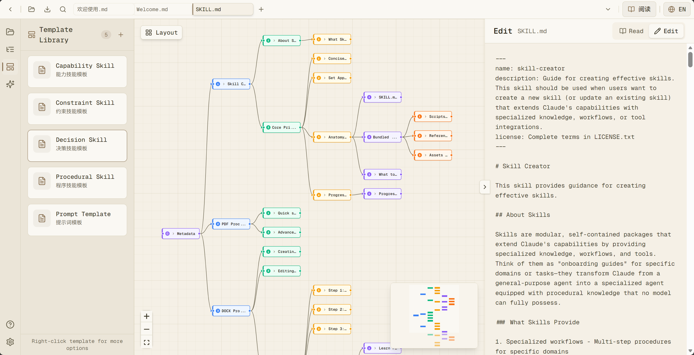
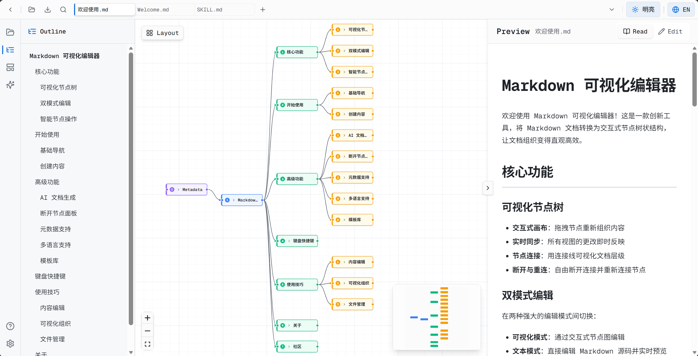
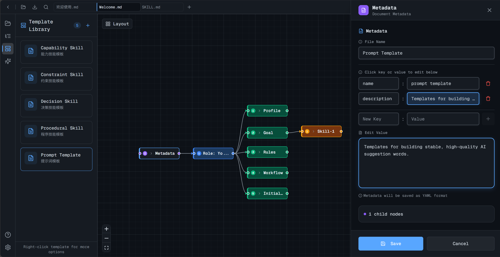

# Visual MD — 可视化Markdown编辑器

<p align="center">
  
</p>

<p align="center">
  <strong>THINK IN TREES!</strong>
</p>

<p align="center">
  <a href="#核心功能">核心功能</a> ·
  <a href="#快速开始">快速开始</a> ·
  <a href="#技术架构">技术架构</a>
</p>

<p align="center">
  <a href="#">
    </a>
  <a href="#">
    </a>
  <a href="#">
    </a>
  <a href="#">
    </a>
  <a href="#">
    </a>
</p>

---

## 简介

**Visual MD** 是一款创新的 Markdown 可视化编辑器，它将传统的文本编辑与现代化的节点编辑相结合。通过直观的树状结构展示文档层级，帮助你**一眼看清文档骨架**，**快速理解内容脉络并高效组织文档结构**。

无论是阅读长篇文档、整理知识笔记，还是规划文章结构、设计提示词，Visual MD 都能帮助你：
- 📊 **快速概览** - 可视化树状结构让文档结构一目了然
- 🔍 **精准定位** - 点击节点即可跳转到对应内容
- ✏️ **高效编辑** - 拖拽调整结构，实时同步更新

### 预览

<p align="center">
  
</p>
<p align="center">
  
  
</p>

- 🎯 **可视化编辑** - 告别纯文本编辑，通过拖拽节点直观组织文档结构
- 🔄 **双向同步** - 可视化编辑与 Markdown 源码实时同步
- ⚡ **高性能** - 基于 React Flow 的流畅画布交互体验
- 🎨 **主题定制** - 支持多种配色主题，满足不同审美需求

---

## 核心功能

### 1. 可视化节点树

- 使用 **React Flow** 展示文档结构
- 支持拖拽节点重新组织内容
- 横向树状布局，清晰展示文档层级
- 一键整理功能，自动优化节点布局

### 2. 双向编辑模式

编辑器支持两种编辑模式无缝切换：

- **可视化模式** - 通过节点图直观编辑文档结构
- **文本模式** - 直接编辑 Markdown 源码

两种模式的修改会实时同步，确保数据一致性。

### 3. 断开节点管理

创新的节点断开与重连功能：

- **断开节点** - 将节点从树结构中分离，保留在断开节点面板
- **重新连接** - 随时将断开节点重新连接到任意父节点
- **层级验证** - 自动验证父子节点层级关系
- **独立管理** - 断开节点面板集中管理所有浮动节点

### 4. 智能节点操作

丰富的节点操作功能：

- **批量创建** - 一次创建多个子节点
- **灵活删除** - 仅删除当前节点（子节点变为断开节点）或删除整个分支
- **节点排序** - 拖拽调整节点顺序
- **边线操作** - 右键边线删除连接，选中边线高亮显示

### 5. 模板系统

提供丰富的文档模板，快速开始写作：

**内置模板**：
- **Capability Skill** - 能力技能文档模板
- **Constraint Skill** - 约束技能文档模板
- **Decision Skill** - 决策技能文档模板
- **Procedural Skill** - 程序技能文档模板
- **Prompt Template** - 提示词模板

**模板功能**：
- 一键应用模板创建新文档
- 支持导入自定义模板（.md 文件）
- 模板内容实时预览和编辑

### 6. AI 文档生成

支持多种 AI 提供商，智能生成结构化文档：

**内置支持的提供商**：
- **OpenAI** - GPT 系列模型
- **火山引擎** - Doubao、DeepSeek 系列
- **硅基流动** - DeepSeek、Qwen 系列
- **智谱 AI** - GLM 系列
- **通义千问** - Qwen 系列
- **OpenRouter** - 多厂商模型聚合
- **自定义** - 支持任意 OpenAI 兼容 API

**功能特性**：
- 智能内容生成，自动生成结构化 Markdown 文档
- 每个提供商独立配置（API 地址、模型、温度参数等）
- 配置测试功能，验证连接可用性
- API 密钥加密存储

### 7. 多语言支持

- **界面语言** - 支持中文和英文界面切换
- **AI 语言检测** - AI 根据用户输入语言自动选择输出语言
- **Unicode 支持** - 完整支持国际字符

### 8. 文件系统管理

- 支持多文件标签页
- 文件夹树状浏览
- 文件创建、重命名、删除
- 自动保存与修改标记
- 导出为 Markdown 或 HTML 格式

### 9. 历史记录与撤销重做

完善的编辑历史管理：

- **撤销/重做** - 支持多步撤销和重做操作
- **历史记录限制** - 最大50条记录，防止内存溢出
- **批量操作合并** - 连续操作自动合并为单条记录
- **操作描述** - 清晰展示可撤销的操作类型

---

## 快速开始

### 环境要求

- **Node.js** >= 22
- **pnpm** >= 8 (推荐)

### 安装

```bash
# 克隆项目
git clone <repository-url>
cd markdown-editor-design

# 安装依赖
pnpm install

# 启动开发服务器
pnpm dev
```

打开浏览器访问 [http://localhost:3000](http://localhost:3000) 即可使用。

### 构建生产版本

```bash
# 构建
pnpm build

# 启动生产服务器
pnpm start
```

---

## 技术架构

### 技术栈

| 类别 | 技术 |
|------|------|
| **框架** | Next.js 16.0, React 19.2 |
| **语言** | TypeScript 5 |
| **样式** | Tailwind CSS 4.1, Radix UI |
| **状态管理** | Zustand 5.0 |
| **可视化** | React Flow 12.3 (@xyflow/react) |
| **Markdown** | unified, remark, rehype, js-yaml |
| **动画** | Framer Motion 12.29 |
| **工具库** | nanoid, lucide-react, date-fns |

### 核心模块

#### 1. Markdown 解析器 (`lib/markdown-parser.ts`)

四步解析算法：

1. **提取 Metadata (YAML Front Matter)** - 使用正则 `/^---\s*\n([\s\S]*?)\n---/` 匹配，使用 `js-yaml` 解析 YAML 元数据
2. **提取标题节点** - 使用正则 `/^(#{1,6})\s+(.+)$/gm` 匹配所有标题
3. **构建树结构** - 优化算法：
   - 确定最大标题层级，创建虚拟根节点
   - 处理孤立节点（无父节点的标题）
   - 使用栈结构，O(n) 时间复杂度构建树
4. **提取内容块** - 为每个节点提取自身内容（不包含子节点内容）

#### 2. Markdown 生成器 (`lib/markdown-generator.ts`)

深度优先遍历算法：

1. **生成 Metadata (YAML Front Matter)** - 自定义 YAML 序列化（处理多行值、特殊字符等）
2. **DFS 生成内容** - 递归遍历树结构：
   - 跳过断开节点（`isDetached=true`）
   - 按 `children` 数组顺序渲染子节点
   - 生成标题和内容块

#### 3. Markdown 预览渲染 (`components/markdown-preview.tsx`)

使用 **Remark** 生态系统进行专业 Markdown 渲染：

- **unified** - 统一的处理器接口，协调整个渲染流程
- **remark-parse** - 将 Markdown 文本解析为语法树
- **remark-gfm** - 支持 GitHub Flavored Markdown（表格、删除线、任务列表等）
- **remark-rehype** - 将 Markdown 语法树转换为 HTML 语法树
- **rehype-stringify** - 将 HTML 语法树序列化为 HTML 字符串
- **主题适配** - 根据当前主题动态生成 CSS 样式

#### 4. 布局引擎 (`lib/layout-engine.ts`)

横向思维导图布局算法：

- **根节点在左侧**，子节点向右展开
- **动态计算节点位置** - 基于层级深度和子树高度
- **父节点居中** - 位于所有子节点的垂直中心
- **断开节点处理** - 保留原位置或放在右侧独立区域
- 时间复杂度：O(n)

---

## 开发指南

### 开发环境设置

```bash
# 安装依赖
pnpm install

# 启动开发服务器（带热重载）
pnpm dev
```

### 代码规范

项目使用 ESLint 进行代码检查：

```bash
# 运行代码检查
pnpm lint
```

---

## 贡献指南

我们欢迎所有形式的贡献！

### 如何贡献

1. **Fork** 本仓库
2. 创建你的功能分支 (`git checkout -b feature/AmazingFeature`)
3. 提交更改 (`git commit -m 'Add some AmazingFeature'`)
4. 推送到分支 (`git push origin feature/AmazingFeature`)
5. 创建 **Pull Request**

### 贡献类型

- 🐛 **Bug 修复** - 修复代码中的问题
- ✨ **新功能** - 添加新功能或改进
- 📚 **文档** - 改进文档或添加示例
- 🎨 **UI/UX** - 改进用户界面和体验
- ⚡ **性能** - 优化性能

---

## 许可证

本项目基于 [Apache-2.0 许可证](LICENSE.txt) 开源。

---

## 致谢

感谢以下开源项目的支持：

- [React Flow](https://reactflow.dev/) - 可视化画布引擎
- [shadcn/ui](https://ui.shadcn.com/) - UI 组件库
- [Zustand](https://github.com/pmndrs/zustand) - 状态管理
- [Remark](https://github.com/remarkjs/remark) - Markdown 处理

---

<p align="center">
  用 ❤️ 构建 | 让 Markdown 编辑更直观、更高效
</p>
